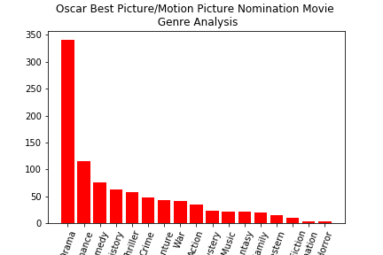
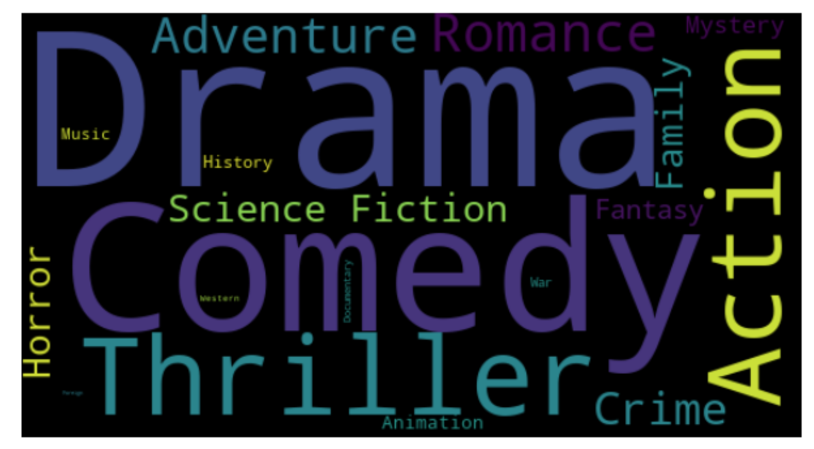
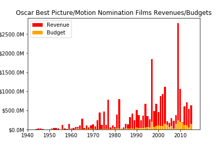
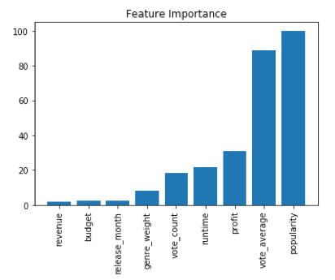
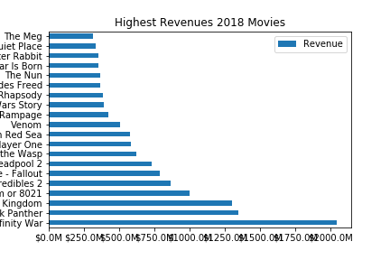
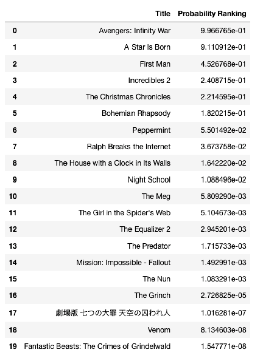

# 2019_Oscar_Best_Picture_Prediction

## What factors are really matters to get the Oscar Best Picture Nomination?
 - Movie related: genres, keywords, runtime
 - Viewers related : vote_average and vote_count
 - Time related: release_date
 - Money related: revenue, budget
 - others
 
## Model Selection
 - Logistic Regression
 - XGBoost
 - Ensemble Training

## DATA Source: TMDB API

- Best Moive Genre Analysis

- Movies Genre Analysis

- Oscar Best Picture Nomination Movies' Revenues/Budgets

- Oscar Movie Featue Importants

- 2018 High Revenues Movies

- Prediction Based on 2018 Nov. Short Lists

